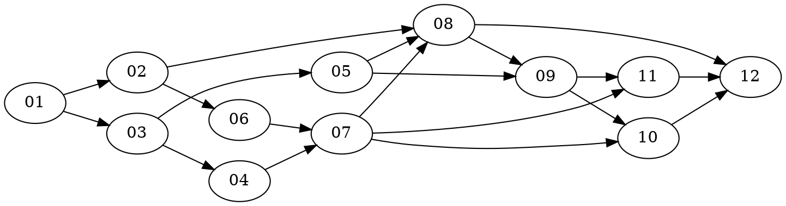

# Task Plan — PiDog Local LLM Brain

## Execution Order

| ID | Task | Phase | Profile | Dependencies | Status | Build Batch |
|----|------|-------|---------|-------------|--------|-------------|
| 01 | Scaffold Repo | 0 — Scaffolding | build | — | done | 1 |
| 02 | Implement Config | 0 — Scaffolding | build | 01 | done | 2 |
| 03 | Action Schema | 0 — Scaffolding | build | 01 | done | 2 |
| 04 | Policy Layer | 0 — Scaffolding | build | 03 | done | 3 |
| 05 | Mock Robot | 0 — Scaffolding | build | 03 | done | 3 |
| 06 | Ollama Client | 1 — LLM Integration | build | 02 | done | 4 |
| 07 | Planner | 1 — LLM Integration | build | 03, 04, 06 | pending | 5 |
| 08 | CLI Demo | 1 — LLM Integration | build | 02, 05, 07 | pending | 6 |
| 09 | PiDog Adapter | 2 — Hardware Bridge | build | 05, 08 | pending | 7 |
| 10 | Voice Loop | 3 — Voice Loop | build | 07, 09 | pending | 8 |
| 11 | Sensor Reactions | 4 — Sensor Reactions | build | 07, 09 | pending | 8 |
| 12 | Demo & Polish | 5 — Demo & Polish | build / scribe | 08, 10, 11 | pending | 9 |

## Build Batches

### Batch 1 (Phase 0a) — Foundation (done)
- **task-01** — Scaffold Repo
- Agent: build
- Acceptance: `pip install -e .` succeeds, `pytest` runs, `import pidog_brain` works

### Batch 2 (Phase 0b) — Core Abstractions (done)
- **task-02** — Implement Config *(depends: 01)*
- **task-03** — Action Schema *(depends: 01)*
- Agent: build
- Acceptance: Config reads env vars with defaults; schema validates action JSON

### Batch 3 (Phase 0c) — Validation & Mock (done)
- **task-04** — Policy Layer *(depends: 03)*
- **task-05** — Mock Robot *(depends: 03)*
- Agent: build
- Acceptance: Policy rejects invalid/unsafe actions; mock robot logs all 14 actions

### Batch 4 (Phase 1a) — LLM Client
- **task-06** — Ollama Client *(depends: 02)*
- Agent: build
- Acceptance: OllamaClient returns text from local Ollama API

### Batch 5 (Phase 1b) — Planning Engine
- **task-07** — Planner *(depends: 03, 04, 06)*
- Agent: build
- Acceptance: Planner produces validated RobotPlan from user input

### Batch 6 (Phase 1c) — CLI & Integration Test
- **task-08** — CLI Demo *(depends: 02, 05, 07)*
- Agent: build
- Acceptance: `python -m pidog_brain.main --mode mock --input "hello"` works end-to-end

### Batch 7 (Phase 2) — Hardware Bridge
- **task-09** — PiDog Adapter *(depends: 05, 08)*
- Agent: build
- Acceptance: PiDogAdapter maps all 14 actions; PiDog imports isolated to one file

### Batch 8 (Phase 3–4) — Voice & Sensors
- **task-10** — Voice Loop *(depends: 07, 09)*
- **task-11** — Sensor Reactions *(depends: 07, 09)*
- Agent: build
- Acceptance: Wake word → STT → LLM → TTS → actions loop works; sensor safety actions fire <500ms

### Batch 9 (Phase 5) — Demo & Closeout
- **task-12** — Demo & Polish *(depends: 08, 10, 11)*
- Agent: build / scribe
- Acceptance: One-command demo runs in mock and hardware modes; docs consistent

## Task DAG (dot notation)

## Risk Flag

**task-09 (PiDog Adapter)** requires physical PiDog hardware to verify. The build agent should write and unit-test the adapter interface (with the actual PiDog library guarded by a try/except import). Full acceptance requires running on a Raspberry Pi 5 with SunFounder libraries installed.

**task-10 and task-11** similarly have hardware-dependent sub-checks. The build agent should implement in mock-first fashion (stubs for audio/sensors that work on a laptop) and note hardware-only checks for the validator.
